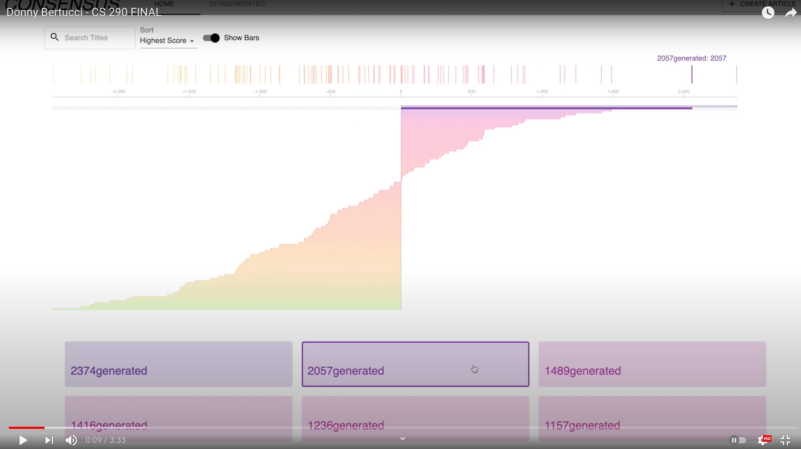

# Consensus

This project was created by Donny Bertucci and is the final project for CS290.

## Demo
click the thumbnail to see the demo or <a href="https://youtu.be/PsU51BCVAvs">click here<a/>
<a href="https://youtu.be/PsU51BCVAvs">
   
<a/>

## Main Idea Behind Consensus

1. Have easy discoverability: more likes more promoted vice versa
2. Create Articles by components with TeX and JS in particular.
3. Find particular articles quickly via filtering.

## Main Directories

`/client` houses the frontend client side code
`/server` houses the backend server code
`/randomGenerate` has some scripts to quickly generate different score
distributions for testing purposes.

## Technologies Used

1. `/client`
   
   a. React - Next.js
   
   b. d3.js - colors and selector functions
   
   c. KaTeX - fast LaTeX rendering
   
   d. SASS - scss for easier styling
   
   e. Material UI - used a few styled components
   
   f. axios - better syntax for get and post requests

2. `/server`
   
   a. Node + Express - server
   
   b. MySQL - Database choice
   
   c. Node MySQL - to interact with the db
  

3. `/randomGenerate`
   
   a. node random - needed for random distr. functions
   
   b. axios - better syntax for get and post requests
